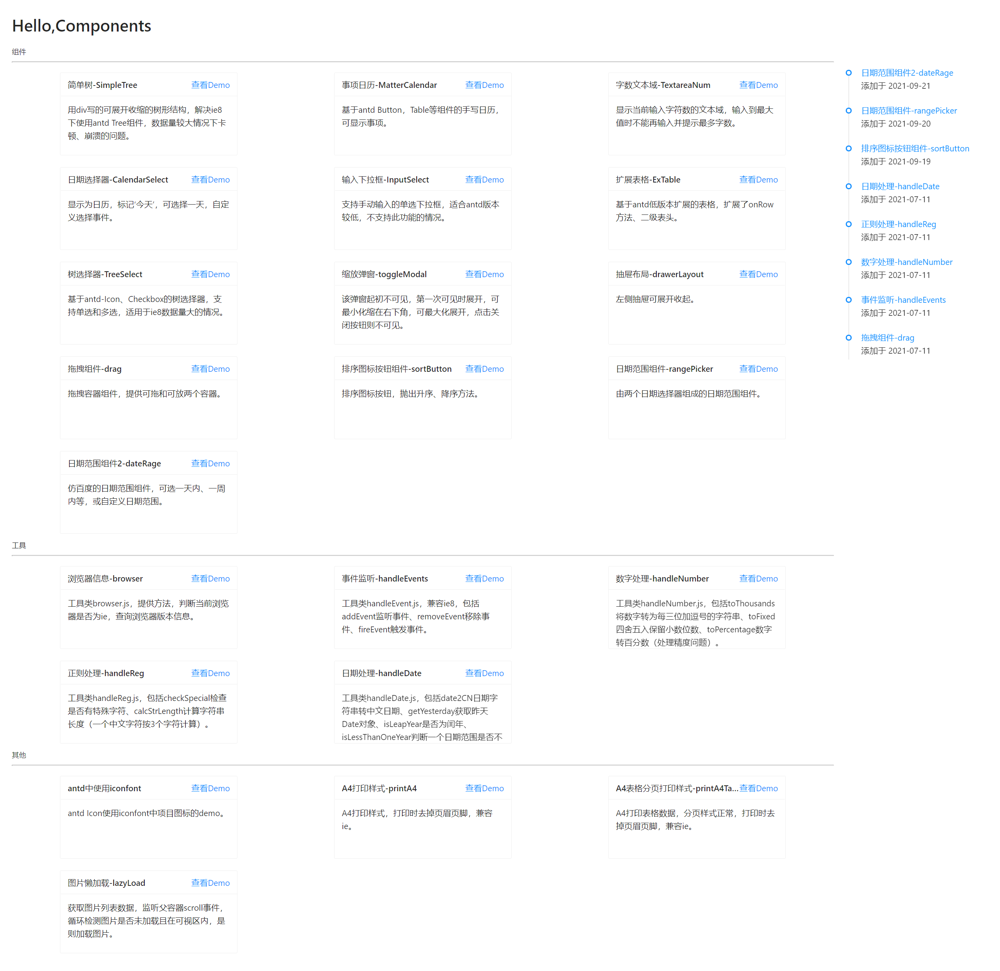
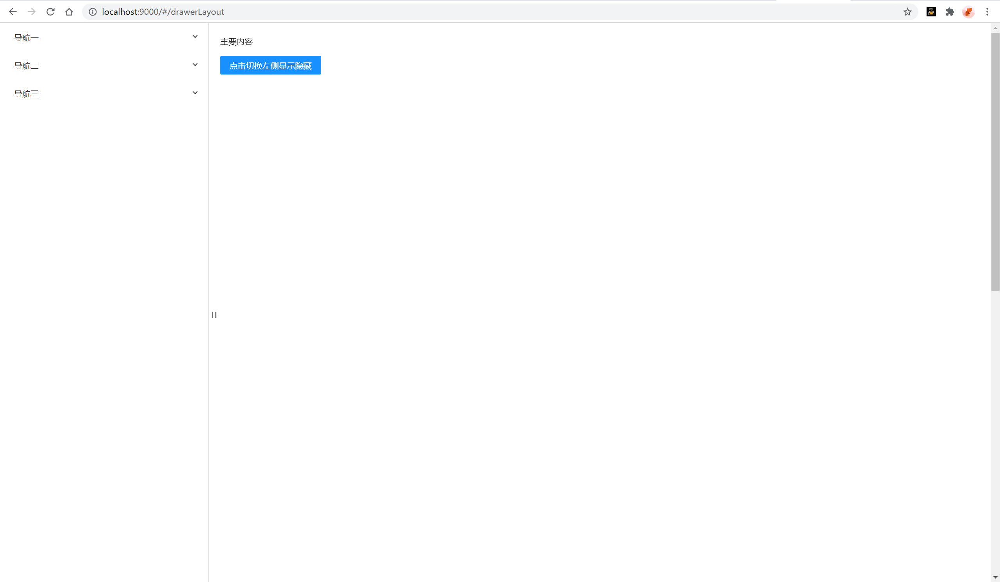

# 效果图



其中一个组件示例图：


# 简介

查看demo: http://47.101.53.139/rc-comp/index.html#/

汇集工作中封装的react组件、工具类、解决方案等。工作环境是基于版本React14，antd@0.12。当前工程React17，antd@4.4.1。因此部分写法按高版本写了。

组件目录在首页http://localhost:9000/#/

# 安装

```bash
npm install
```

# 启动

http://localhost:9000/#/

```bash
npm run dev
```

# 使用

webpack别名配置在项目config/alias.js中。如：

```js
"views": path.resolve(__dirname, "../src/views/")
```